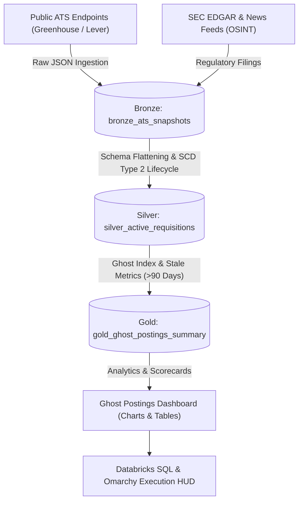

# 👻 Ghost Job Intelligence & Medallion Analytics Engine

An automated, Medallion Architecture pipeline (Bronze ➔ Silver ➔ Gold) and rich analytics frontend tracking public ATS boards (Greenhouse, Lever, Workday) across the **Top 100 Largest Public Tech Companies** to expose phantom postings, 90-day stale requisition loops, and OSINT news alerts.

---

## 🏛️ Medallion Architecture Overview




---

## 🚀 Key Features

1. **Top 100 Public Tech & Industrial Enterprise Registry:**
   - Real-time polling across public ATS APIs & career endpoints for **Google (Alphabet), Microsoft, Meta Platforms, NVIDIA, Walmart Global Tech, Goodyear Tire & Rubber, Michelin Group, General Electric (GE), GitLab, Block, Robinhood, Cloudflare, Datadog, Snowflake, CrowdStrike, Palantir, etc.**

2. **3-Tier Medallion Architecture (PySpark & Delta Lake):**
   - **Bronze (`bronze_ats_snapshots`):** Ingests raw JSON snapshots from Greenhouse, Lever, Workday, and corporate APIs.
   - **Silver (`silver_active_requisitions`):** SCD Type 2 lifecycle tracking recording `first_seen_at`, `last_seen_at`, active status, and detecting algorithmic repost loops.
   - **Gold (`gold_ghost_postings_summary`):** Computes **Ghost Risk Ratio (%)**, average listing age in days, and $>90$-day stale requisition exposure.

3. **Ghost Job OSINT & SEC EDGAR Scraper:**
   - Aggregates live RSS intelligence feeds, survey benchmarks (Clarify Capital), and SEC EDGAR headcount vs. hiring freeze disclosure warnings.

4. **Rich Visual Analytics & Corporate Data Matrix:**
   - Standalone dashboard featuring Chart.js ranking bar charts, risk tier distribution doughnuts, searchable corporate scorecards, and live OSINT news feeds.


---

## 📊 Databricks SQL Dashboard Queries

```sql
-- Gold Layer Reckoning: Exposing Stale Ghost Requisitions (>90 Days)
SELECT 
    company_token,
    company_name,
    total_active_listings,
    ROUND(avg_listing_age_days, 1) AS avg_days_open,
    stale_listings_over_90d,
    ROUND(ghost_risk_pct, 2) AS ghost_risk_pct,
    risk_tier,
    top_stale_role
FROM gold_ghost_postings_summary
ORDER BY ghost_risk_pct DESC;
```

---

## 🛠️ Quickstart & Local Execution

```bash
# Clone & install dependencies
pip install -r requirements.txt

# Run full Medallion Flywheel (Bronze -> Silver -> Gold)
python -m src.orchestrator

# Launch FastAPI & Interactive Visualizer on port 8900
python -m src.api
```
