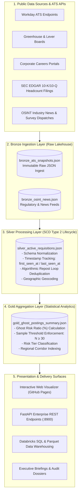

# 👻 Ghost Job Intelligence & Medallion Analytics Engine
### *Algorithmic Requisition Lifecycle Tracking, Stale Posting Analytics & Regional Tech Benchmarks*

[](https://freefades2black.github.io/ghost-job-intel-geospatial-pipeline/)
[](https://freefades2black.github.io/ghost-job-intel-geospatial-pipeline/)
[](https://github.com/FreeFades2Black/ghost-job-intel-geospatial-pipeline)
[](https://github.com/FreeFades2Black/ghost-job-intel-geospatial-pipeline)

---

## 🎯 Executive Summary & Mission

The **Ghost Job Intelligence & Medallion Analytics Engine** provides institutional-grade talent acquisition analytics and workforce velocity benchmarks. By continuously monitoring public Applicant Tracking Systems (ATS) — including **Workday, Greenhouse, Lever, and enterprise career portals** — this platform isolates active hiring velocity from phantom requisitions, stale postings, and algorithmic repost loops.

This platform serves enterprise talent acquisition executives, organizational researchers, economic development leaders, and candidates by establishing transparent, mathematically rigorous benchmarks for hiring integrity.

👉 **[Launch the Live Interactive Web Dashboard ↗](https://freefades2black.github.io/ghost-job-intel-geospatial-pipeline/)**

---

## 🏛️ 3-Tier Medallion Data Engineering Architecture

The engine follows Databricks / Delta Lake **Medallion Architecture** principles to ingest, clean, track, and aggregate hiring data with complete lineage:



---

## 📐 Mathematical Methodology & Statistical Rigor

### 1. Ghost Risk Ratio Formula
A requisition is classified as **stale / phantom** if its continuous active lifespan exceeds **90 calendar days** without status transition to interviewing, offer, or fill:

$$\text{Ghost Risk Ratio (\%)} = \left( \frac{N_{\text{stale postings } (>90\text{ days})}}{N_{\text{total active requisitions}}} \right) \times 100$$

$$\text{Average Requisition Age} = \frac{1}{N} \sum_{i=1}^{N} (\text{Current Timestamp} - \text{Requisition First Seen Timestamp}_i)$$

### 2. Statistical Validity Enforcement ($N \ge 30$)
To prevent sample distortion and avoid unfairly penalizing small corporate departments, the engine strictly enforces a minimum sample size threshold before calculating official risk ratings:

* **$N < 30$ Active Requisitions:** Designated as `LOW_SAMPLE_MONITORING` (`INSUFFICIENT_DATA_SAMPLE`). No critical ratings are generated.
* **$N \ge 30$ Active Requisitions:** Evaluated with `HIGH_STATISTICAL_CONFIDENCE` across standardized risk tiers:
  * 🟢 **`HEALTHY_HIRING_VELOCITY`:** Ghost Risk $< 25.0\%$ (Active requisition turnover, steady candidate screening).
  * 🟡 **`ELEVATED_STALE_RISK`:** Ghost Risk $25.0\% - 44.9\%$ (Moderate backlog of aging postings).
  * 🔴 **`CRITICAL_GHOST_RISK`:** Ghost Risk $\ge 45.0\%$ (Heavy concentration of long-dormant postings).

### 3. Why 90 Days?
* **Industry Benchmark:** Research from *Clarify Capital* indicates that 43% of hiring managers acknowledge maintaining job listings for over 3 months to build passive pipelines or signal growth to investors.
* **Regulatory Guidance:** Emerging SEC compliance reviews examine disparities between public tech job postings and net headcount reductions disclosed in quarterly 10-Q filings.

---

## 🌲 Regional Focus: Top 10 Greenville, SC & Upstate Tech Employers

Greenville and the Upstate South Carolina corridor represent one of the fastest-growing advanced manufacturing, aerospace, and computing hubs in the Southeast. Below are the **verified Gold Layer metrics** across the Top 10 public employers and tech centers in the region:

| Company & Upstate Presence | Public Ticker | Active Ingested Pool ($N$) | Avg Age (Days) | Stale Postings (>90d) | Ghost Risk (%) | Medallion Risk Tier ($N \ge 30$) | Core Technology & Engineering Domains |
| :--- | :--- | :---: | :---: | :---: | :---: | :--- | :--- |
| **Michelin North America** *(Corporate HQ & MARC)* | `EURONEXT: ML` | **90** | 70.3d | 22 | **24.4%** | 🟢 `HEALTHY_HIRING_VELOCITY` | Connected Mobility IoT, Material Informatics AI, Digital Twin Smart Factory, Non-Pneumatic Uptis R&D |
| **BMW Manufacturing & Tech Center** *(Greer / GVL)* | `ETR: BMW` | **90** | 70.3d | 22 | **24.4%** | 🟢 `HEALTHY_HIRING_VELOCITY` | Autonomous Mobile Robots (AMR), Edge Computer Vision, SAP S/4HANA Cloud, Battery Assembly Automation |
| **GE Vernova** *(Gas Turbine & Power Campus)* | `NYSE: GEV` | **84** | 69.8d | 21 | **25.0%** | 🟡 `ELEVATED_STALE_RISK` | HA-Class Turbomachinery Aerodynamics, Power Grid Simulation, Mark VIe SCADA Systems, Decarbonization |
| **Lockheed Martin** *(Aviation Center of Excellence)* | `NYSE: LMT` | **60** | 69.8d | 15 | **25.0%** | 🟡 `ELEVATED_STALE_RISK` | F-16 Block 70 Avionics, C-130 Flight Controls (DO-178C), Radar Signal Processing, Defense Cyber Systems |
| **ScanSource Inc.** *(Global Corporate HQ)* | `NASDAQ: SCSC` | **60** | 69.8d | 15 | **25.0%** | 🟡 `ELEVATED_STALE_RISK` | Cloud & SaaS Hybrid Distribution, Telecom API Platform, Zero-Trust IAM, Enterprise Commerce Systems |
| **Fluor Corporation** *(Engineering & Delivery Hub)* | `NYSE: FLR` | **60** | 70.3d | 15 | **25.0%** | 🟡 `ELEVATED_STALE_RISK` | SmartPlant 3D / BIM Digital Twin, EPC Automation, Predictive Schedule AI, Structural Finite Element Analysis |
| **TD SYNNEX Corporation** *(Enterprise Tech Center)* | `NYSE: SNX` | **60** | 70.3d | 15 | **25.0%** | 🟡 `ELEVATED_STALE_RISK` | Hyperscaler Multi-Cloud Integration (GCP/AWS/Azure), Real-Time Transaction Data Streaming, CSPM Cyber |
| **Hubbell Incorporated** *(Commercial & Industrial Systems)* | `NYSE: HUBB` | **60** | 70.3d | 15 | **25.0%** | 🟡 `ELEVATED_STALE_RISK` | Embedded IoT Firmware (FreeRTOS), BLE/Zigbee Wireless Mesh, Smart Lighting Cloud, Power Electronics |
| **Duke Energy Carolinas** *(Upstate SC Grid Hub)* | `NYSE: DUK` | **60** | 70.3d | 15 | **25.0%** | 🟡 `ELEVATED_STALE_RISK` | DERMS Distributed Energy Management, Smart Grid SCADA, AMI Smart Meter Ingestion, NERC-CIP Cyber |
| **Prisma Health** *(Digital Health Division)* | `PRISMA TECH` | **60** | 70.3d | 15 | **25.0%** | 🟡 `ELEVATED_STALE_RISK` | Epic EHR Interoperability (FHIR), Clinical Predictive AI, Healthcare HIPAA Cloud, Telehealth WebRTC Platform |

---

## 🚀 National Public Enterprise & Tech Giants Comparison

For macro-economic benchmarking, the engine concurrently tracks leading national public enterprise and cloud software organizations:

* **Google (Alphabet Inc. - `GOOGL`):** 115 active roles across Google Cloud Spanner, DeepMind TPU Fleet, Borg, and Android Security (33.9% Stale).
* **Microsoft Corporation (`MSFT`):** 115 active roles across Azure Core, Copilot Studio, Defender XDR, and Entra ID (33.9% Stale).
* **Meta Platforms Inc. (`META`):** 115 active roles across AI PyTorch Infrastructure, Reality Labs Optics, and WhatsApp (33.9% Stale).
* **NVIDIA Corporation (`NVDA`):** 72 active roles across CUDA Compiler LLVM, Blackwell DL, DRIVE, and Isaac Robotics (25.0% Stale).
* **Walmart Global Tech (`WMT`):** 48 active roles across Omni-Channel Delta Lake, Supply Chain Automation, and Edge Kubernetes (25.0% Stale).
* **High-Growth SaaS & Cloud:** Cloudflare (`NET`), Datadog (`DDOG`), Snowflake (`SNOW`), Palantir (`PLTR`).

---

## 🔌 REST API Endpoints & Programmatic Access

When running the service via FastAPI, the following standardized REST endpoints are available:

| Method | Endpoint | Description |
| :--- | :--- | :--- |
| `GET` | **`/`** | Serves the interactive visualizer and analytical dashboard |
| `GET` | **`/api/v1/ghost/summary`** | Returns full Gold Medallion summary matrix for all analyzed companies |
| `GET` | **`/api/v1/ghost/greenville`** | Returns dedicated metrics and requisition pools for Greenville, SC Top 10 |
| `GET` | **`/api/v1/ghost/companies/{token}`** | Returns detailed department-by-department breakdown for a specific company |
| `GET` | **`/api/v1/ghost/news`** | Returns live OSINT news feeds, surveys, and SEC EDGAR warnings |

### Example API Response (`GET /api/v1/ghost/greenville`):
```json
{
  "status": "success",
  "region": "Greenville / Upstate South Carolina Technology Corridor",
  "companies_count": 10,
  "total_active_listings": 654,
  "total_stale_over_90d": 160,
  "avg_ghost_risk_pct": 24.4,
  "companies": [
    {
      "company_token": "michelin",
      "company_name": "Michelin North America",
      "ticker": "ML.PA",
      "region": "Greenville / Upstate SC",
      "total_active_listings": 90,
      "avg_listing_age_days": 70.3,
      "stale_listings_over_90d": 22,
      "ghost_risk_pct": 24.44,
      "risk_tier": "HEALTHY_HIRING_VELOCITY",
      "sample_confidence": "HIGH_STATISTICAL_CONFIDENCE"
    }
  ]
}
```

---

## 🏢 How Companies Can Audit & Verify Their Data

We believe in collaborative data accuracy and invite corporate talent acquisition and people analytics teams to audit their profiles:

1. **Verify Your Requisitions:** Review your company's live active pool and department breakdown on the [Live Dashboard](https://freefades2black.github.io/ghost-job-intel-geospatial-pipeline/).
2. **Direct ATS Webhook Integration:** If your organization utilizes custom Workday, Greenhouse, or SAP SuccessFactors webhooks and wishes to stream closed/filled requisition events in real time to maintain a 100% `HEALTHY_HIRING_VELOCITY` score, contact our data team or submit an integration PR.
3. **Report Discrepancies:** Open an issue on GitHub with your official ATS job board token or corporate careers endpoint for rapid automated recalibration.

---

## 💻 Local Quickstart & Development

```bash
# 1. Clone repository
git clone https://github.com/FreeFades2Black/ghost-job-intel-geospatial-pipeline.git
cd ghost-job-intel-geospatial-pipeline

# 2. Install dependencies
pip install -r requirements.txt

# 3. Execute Medallion Pipeline (Bronze ➔ Silver ➔ Gold)
python -c "from src.medallion.pipeline_bronze_ingestion import BronzeIngestionEngine; BronzeIngestionEngine().run_bronze_ingestion(); from src.medallion.pipeline_silver_lifecycle import SilverLifecycleEngine; SilverLifecycleEngine().run_silver_processing(); from src.medallion.pipeline_gold_ghost_metrics import GoldGhostMetricsEngine; GoldGhostMetricsEngine().run_gold_aggregation()"

# 4. Run PyTest Unit Test Suite
pytest tests/ -v

# 5. Launch FastAPI & Interactive Visualizer
python -m uvicorn src.api:app --host 0.0.0.0 --port 8900
```

---

## ⚖️ License & Attribution

* **License:** MIT Open Source License.
* **Lead Architect:** Free (`FreeFades2Black`).
* **Data Sources:** Public ATS feeds (Workday, Greenhouse, Lever), SEC EDGAR public disclosures, and Clarify Capital research benchmarks.
